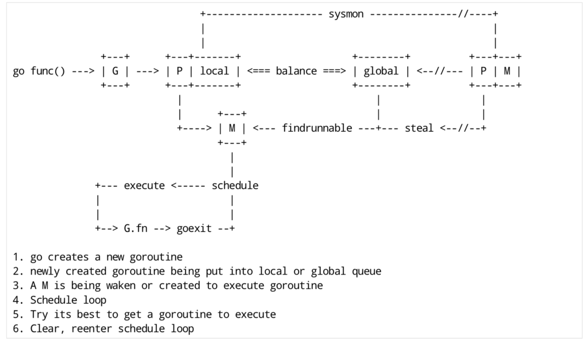

```go
//全局变量
//所有g的长度
allglen uintptr

//保存所有的g
allgs    []*g

//保存所有的m
allm        *m

// 保存所有的 p，_MaxGomaxprocs = 1024
allp        [_MaxGomaxprocs + 1]*p

// p 的最大值，默认等于 ncpu
gomaxprocs  int32

// 程序启动时，会调用 osinit 函数获得此值
ncpu        int32

// 调度器结构体对象，记录了调度器的工作状态
//go shcheduler在源码中的结构体为 schedt，保存调度器的信息、全局可运行的
sched       schedt 

// 代表进程的主线程 m0为全局变量，要绑定到工作线程才能执行
m0           m

// m0 的 g0，即 m0.g0 = &g0
g0           g

//程序初始化的时，这些全局变量都会被初始化为零值；所以程序刚启动的时allgs，allm，allp都不包含任何g，m和p
```


## goroutine和thread区别

> goroutine用户态
>
> thread内核态

- 内存占用

创建一个goroutine内存消耗为2KB。创建一个thread内存消耗为1MB，而且还需要一个被称为“a gurad page”的区域用于和其他thread的栈空间进行隔离

对于Go server来说，对于每一个请求都是新创建一个goroutine来处理，单独的请求。如果对于thread作为并发原语很快程序就会OOM

- 创建和销毁

thread的创建和销毁消耗巨大，因为是和内核级的操作，通常需要线程池来解决。

goroutine是由go runtime 负责管理，创建和销毁的，消耗特别小，是用户级的

- 切换

thread切换，需要保存各种寄存器的值，以便将来进行恢复

goroutine切换只需要保存三个寄存器：program counter，stack pointer and BP

一般：thread切换需要消耗1000-1500纳秒，gouroutine切换需要200ns

## scheduler

- 组成

1. Go的执行程序由两部分组成：Go program，Runtime即用户程序和运行时

2. 用户程序进行的系统调用都会被Runtime拦截，以此来帮助它进行调度以及垃圾回收相关工作（Runtime维护所有的goroutine，并通过scheduler来进行调度）

- 通常系统加载运行步骤

不仅是Go程序，系统加载可执行文件大概都会经过几个阶段：

1. 从磁盘读取可执行文件加载到内存
2. 创建进程和主线程
3. 为主线程分配栈空间
4. 把由用户在命令行输入的参数拷贝到主线程的栈
5. 把主线程放入操作系统运行队列等待被调度

- go程序初始化过程

1. 初始化系统核心数

2. 调度器初始化

   > 总结：
   >
   > 1. 使用make([]*p, procs)初始化全局变量allp，即allp = make([]\*p, nprocs)
   > 2. 循环创建并初始化nprocs个p结构体对象，并保存在allp切片中
   > 3. 将m0和allp[0]绑定在一起，即m0.p = allp[0]，allp[0].m = m0
   > 4. 把除了allp[0]之外的所有p放入全局变量sched的pidle空闲队列中
   >
   > 备注：代码里是将所有空闲的P放入到调度器的全局空闲队列，对于非空闲的P（本地队列里有G在执行），则是生成一个P链表，返回给procesize函数的调用者

   ```go
   func schedinit() {
   	// getg 由编译器实现
   	// get_tls(CX)
   	// MOVQ g(CX), BX; BX存器里面现在放的是当前g结构体对象的地址
   	_g_ := getg() //返回当前正在运行的goroutine指针
   	if raceenabled {
   		_g_.racectx, raceprocctx0 = raceinit()
   	}
   
   	// 最多启动 10000 个工作线程
   	sched.maxmcount = 10000
   
   	tracebackinit()
   	moduledataverify()
   
   	// 初始化栈空间复用管理链表
   	stackinit()
   	mallocinit()
   
   	// 初始化 m0
   	mcommoninit(_g_.m)
   	alginit()       // maps must not be used before this call
   	modulesinit()   // provides activeModules
   	typelinksinit() // uses maps, activeModules
   	itabsinit()     // uses activeModules
   
   	msigsave(_g_.m)
   	initSigmask = _g_.m.sigmask
   
   	goargs()
   	goenvs()
   	parsedebugvars()
   	gcinit()
   
   	sched.lastpoll = uint64(nanotime())
   
   	// 初始化 P 的个数
   	// 系统中有多少核，就创建和初始化多少个 p 结构体对象
   	procs := ncpu
   	if n, ok := atoi32(gogetenv("GOMAXPROCS")); ok && n > 0 {
   		procs = n
   	}
   	if procs > _MaxGomaxprocs {
   		procs = _MaxGomaxprocs
   	}
   
   	// 初始化所有的 P，正常情况下不会返回有本地任务的 P
   	if procresize(procs) != nil {
   		throw("unknown runnable goroutine during bootstrap")
   	}
   }
   ```

   

3. 创建新的goroutine

4. 调用runtime.mstart，启动调度循环

5. 在新的goroutine上运行runtime.main函数

- **什么是g0栈**？g0是指当前工作线程的g0，g0栈的作用是为运行runtime代码提供一个“环境”

> 调用 systemstack 函数在 g0 栈执行 fn 函数。由于本文讲述的是初始化过程中，由 `runtime·rt0_go` 函数调用，本身是在 g0 栈执行，因此会直接执行 fn 函数。而如果是我们在程序中写的 `go xxx` 代码，在执行时，就会先切换到 g0 栈执行，然后再切回来。


- 主goroutine如何创建

### Scheduler底层原理

有三个基础结构来实现goroutine的调度（GPM）

- g：代表一个goroutine，它包含goroutine栈的一些字段，指示当前goroutine的状态，指示当前运行到的指令地址，也就是PC的值
- m：代表内核线程，包含正在运行的goroutine字段
- p：代表一个虚拟的Processor，维护一个处于Runable状态的g队列，m需要获得p才能运行g

还有一个核心结构体 `sched`，它总览全局。

Os scheduler核心思想：

1. resuse thread
2. 限制同时运行（不包含阻塞）的线程数为N，N等于CPU核心数目
3. 线程私有的runqueues，可以从其他线程stealing goroutine来运行，线程阻塞后，可以将runqueues 传递给其他线程

goroutine的三种状态：

| 状态      | 解释                                                         |
| :-------- | ------------------------------------------------------------ |
| Waiting   | 等待状态，goroutine在等待某件事发生。例如等待网络数据、硬盘；调用操作系统API；等待内存同步访问条件ready如：atomic、mutexes |
| Runnable  | 就绪状态只要给我M就能运行                                    |
| Executing | 运行状态。goroutine在M上执行命令                             |

GPM全局示意图：



## M：N

Go runtime会负责goroutine的生老病死，从创建到销毁一手包办。runtime会在程序启动的时候创建M个线程，之后创建的N的goroutine都会依附在M个线程上执行。


需要了解的知识点：

1. 线程私有变量，TLS技术


[参考文章]: https://mp.weixin.qq.com/s/W9D4Sl-6jYfcpczzdPfByQ


